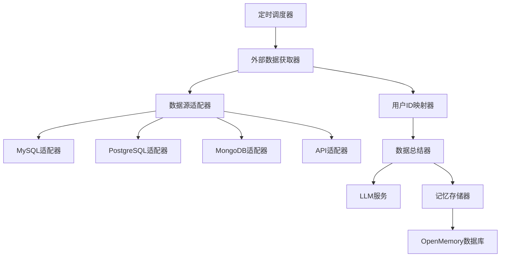

# 外部数据源同步功能实现计划

## 📋 功能概述

实现一个独立的新功能模块，用于：
1. 从外部数据库获取多用户信息
2. 按用户ID分组总结提炼信息
3. 存储到本地OpenMemory数据库
4. 定时自动执行同步任务

## 🏗️ 系统架构



## 📁 文件结构

在 `api/app/` 目录下创建新模块，不修改现有代码：

```
api/app/
├── external_sync/                    # 新功能模块目录
│   ├── __init__.py
│   ├── config.py                     # 外部数据源配置
│   ├── models.py                     # 数据模型
│   ├── adapters/                     # 数据源适配器
│   │   ├── __init__.py
│   │   ├── base.py                   # 基础适配器接口
│   │   ├── mysql_adapter.py
│   │   ├── postgres_adapter.py
│   │   ├── mongodb_adapter.py
│   │   └── api_adapter.py
│   ├── services/                     # 业务服务
│   │   ├── __init__.py
│   │   ├── data_fetcher.py           # 数据获取服务
│   │   ├── user_mapper.py            # 用户ID映射服务
│   │   ├── summarizer.py             # 数据总结服务
│   │   └── memory_store.py           # 记忆存储服务
│   ├── scheduler.py                  # 定时任务调度器
│   └── router.py                     # API路由
├── external_sync_config.json         # 配置文件
```

## 🔧 核心实现

### 1. 配置文件设计 (external_sync_config.json)

```json
{
  "enabled": true,
  "sync_interval_minutes": 60,
  "max_retries": 3,
  "batch_size": 100,
  "sources": [
    {
      "id": "source_1",
      "name": "用户数据库",
      "type": "mysql",
      "enabled": true,
      "connection": {
        "host": "env:EXTERNAL_DB_HOST",
        "port": 3306,
        "database": "env:EXTERNAL_DB_NAME",
        "username": "env:EXTERNAL_DB_USER",
        "password": "env:EXTERNAL_DB_PASSWORD"
      },
      "query": {
        "sql": "SELECT user_id, content, created_at FROM memories WHERE updated_at > :last_sync_time",
        "user_id_field": "user_id",
        "content_field": "content",
        "timestamp_field": "created_at"
      },
      "user_mapping": {
        "type": "direct",
        "source_field": "user_id",
        "transform": null
      }
    }
  ],
  "summarization": {
    "enabled": true,
    "prompt_template": "请从以下信息中提取关于用户的重要事实...",
    "max_tokens": 2000,
    "batch_size": 10
  }
}
```

### 2. 基础适配器接口 (adapters/base.py)

```python
from abc import ABC, abstractmethod
from typing import List, Dict, Any, Optional
from datetime import datetime

class BaseDataSourceAdapter(ABC):
    """外部数据源适配器基类"""
    
    def __init__(self, config: dict):
        self.config = config
        self.source_id = config.get("id")
        self.source_name = config.get("name")
    
    @abstractmethod
    async def connect(self) -> bool:
        """建立连接"""
        pass
    
    @abstractmethod
    async def disconnect(self) -> None:
        """断开连接"""
        pass
    
    @abstractmethod
    async def fetch_data(
        self, 
        last_sync_time: Optional[datetime] = None,
        batch_size: int = 100
    ) -> List[Dict[str, Any]]:
        """获取数据"""
        pass
    
    @abstractmethod
    async def get_user_ids(self) -> List[str]:
        """获取所有用户ID"""
        pass
    
    @abstractmethod
    async def fetch_user_data(
        self, 
        user_id: str,
        last_sync_time: Optional[datetime] = None
    ) -> List[Dict[str, Any]]:
        """获取指定用户的数据"""
        pass
```

### 3. MySQL适配器示例 (adapters/mysql_adapter.py)

```python
import aiomysql
from typing import List, Dict, Any, Optional
from datetime import datetime
from .base import BaseDataSourceAdapter

class MySQLAdapter(BaseDataSourceAdapter):
    """MySQL数据源适配器"""
    
    def __init__(self, config: dict):
        super().__init__(config)
        self.pool = None
        self.connection_config = config.get("connection", {})
        self.query_config = config.get("query", {})
    
    async def connect(self) -> bool:
        try:
            self.pool = await aiomysql.create_pool(
                host=self._resolve_env(self.connection_config.get("host")),
                port=self.connection_config.get("port", 3306),
                db=self._resolve_env(self.connection_config.get("database")),
                user=self._resolve_env(self.connection_config.get("username")),
                password=self._resolve_env(self.connection_config.get("password")),
                autocommit=True
            )
            return True
        except Exception as e:
            logger.error(f"MySQL连接失败: {e}")
            return False
    
    async def disconnect(self) -> None:
        if self.pool:
            self.pool.close()
            await self.pool.wait_closed()
    
    async def fetch_data(
        self, 
        last_sync_time: Optional[datetime] = None,
        batch_size: int = 100
    ) -> List[Dict[str, Any]]:
        sql = self.query_config.get("sql")
        async with self.pool.acquire() as conn:
            async with conn.cursor(aiomysql.DictCursor) as cursor:
                await cursor.execute(sql, {"last_sync_time": last_sync_time})
                return await cursor.fetchmany(batch_size)
    
    async def get_user_ids(self) -> List[str]:
        user_id_field = self.query_config.get("user_id_field", "user_id")
        sql = f"SELECT DISTINCT {user_id_field} FROM ({self.query_config.get('sql')}) AS t"
        async with self.pool.acquire() as conn:
            async with conn.cursor() as cursor:
                await cursor.execute(sql.replace(":last_sync_time", "NULL"))
                rows = await cursor.fetchall()
                return [str(row[0]) for row in rows]
    
    async def fetch_user_data(
        self, 
        user_id: str,
        last_sync_time: Optional[datetime] = None
    ) -> List[Dict[str, Any]]:
        user_id_field = self.query_config.get("user_id_field", "user_id")
        base_sql = self.query_config.get("sql")
        sql = f"{base_sql} AND {user_id_field} = :user_id"
        async with self.pool.acquire() as conn:
            async with conn.cursor(aiomysql.DictCursor) as cursor:
                await cursor.execute(sql, {
                    "last_sync_time": last_sync_time,
                    "user_id": user_id
                })
                return await cursor.fetchall()
    
    def _resolve_env(self, value: str) -> str:
        """解析环境变量"""
        if value and value.startswith("env:"):
            import os
            return os.getenv(value[4:], "")
        return value
```

### 4. 用户ID映射服务 (services/user_mapper.py)

```python
from typing import Any, Optional
from uuid import UUID
import re

class UserIdMapper:
    """用户ID映射服务"""
    
    TRANSFORM_FUNCTIONS = {
        "direct": lambda x: str(x),
        "uuid_to_string": lambda x: str(x).replace("-", ""),
        "string_to_uuid": lambda x: str(UUID(x)),
        "lowercase": lambda x: str(x).lower(),
        "uppercase": lambda x: str(x).upper(),
        "prefix_remove": lambda x, prefix: str(x).replace(prefix, "", 1),
        "prefix_add": lambda x, prefix: f"{prefix}{x}",
    }
    
    def __init__(self, mapping_config: dict):
        self.config = mapping_config
        self.transform_type = mapping_config.get("type", "direct")
        self.source_field = mapping_config.get("source_field", "user_id")
        self.transform_params = mapping_config.get("transform_params", {})
    
    def map_user_id(self, source_data: dict) -> Optional[str]:
        """将外部用户ID映射到本地用户ID"""
        source_value = source_data.get(self.source_field)
        if source_value is None:
            return None
        
        transform_func = self.TRANSFORM_FUNCTIONS.get(self.transform_type)
        if not transform_func:
            return str(source_value)
        
        try:
            if self.transform_params:
                return transform_func(source_value, **self.transform_params)
            return transform_func(source_value)
        except Exception as e:
            logger.error(f"用户ID映射失败: {e}")
            return str(source_value)
    
    def reverse_map(self, local_user_id: str) -> str:
        """反向映射（本地ID到外部ID）"""
        # 根据需要实现反向映射逻辑
        return local_user_id
```

### 5. 数据总结服务 (services/summarizer.py)

```python
from typing import List, Dict, Any
from app.utils.memory import get_memory_client
import json

class DataSummarizer:
    """数据总结服务 - 使用现有LLM配置"""
    
    DEFAULT_PROMPT = """
你是一个专业的信息提取助手。请从以下用户数据中提取重要的事实信息。

用户ID: {user_id}
数据来源: {source_name}
原始数据:
{raw_data}

请提取关键信息，包括：
1. 用户的基本信息（姓名、年龄、职业等）
2. 用户的偏好和习惯
3. 用户的重要行为或事件
4. 其他值得记忆的信息

规则：
- 只提取明确的事实信息，不要推测
- 每条信息应该是一个完整、独立的陈述
- 使用简洁、自然的中文表达
- 如果没有明确的事实信息，返回空列表

请以JSON格式返回，格式如下：
{{"facts": ["事实1", "事实2", ...]}}
"""
    
    def __init__(self, config: dict = None):
        self.config = config or {}
        self.prompt_template = self.config.get("prompt_template", self.DEFAULT_PROMPT)
        self.max_tokens = self.config.get("max_tokens", 2000)
        self.batch_size = self.config.get("batch_size", 10)
    
    async def summarize_user_data(
        self,
        user_id: str,
        source_name: str,
        data_list: List[Dict[str, Any]]
    ) -> List[str]:
        """总结用户数据，返回事实列表"""
        if not data_list:
            return []
        
        # 准备数据
        raw_data = json.dumps(data_list, ensure_ascii=False, indent=2)
        
        # 构建提示词
        prompt = self.prompt_template.format(
            user_id=user_id,
            source_name=source_name,
            raw_data=raw_data[:10000]  # 限制长度
        )
        
        # 调用LLM
        try:
            memory_client = get_memory_client()
            if memory_client and hasattr(memory_client, 'llm'):
                response = await self._call_llm(memory_client.llm, prompt)
                return self._parse_response(response)
        except Exception as e:
            logger.error(f"数据总结失败: {e}")
        
        return []
    
    async def _call_llm(self, llm, prompt: str) -> str:
        """调用LLM服务"""
        # 使用现有的LLM配置
        response = llm.generate_response(
            messages=[{"role": "user", "content": prompt}]
        )
        return response
    
    def _parse_response(self, response: str) -> List[str]:
        """解析LLM响应"""
        try:
            # 尝试解析JSON
            data = json.loads(response)
            if isinstance(data, dict) and "facts" in data:
                return data["facts"]
            if isinstance(data, list):
                return data
        except json.JSONDecodeError:
            # 如果不是JSON，按行分割
            lines = response.strip().split("\n")
            return [line.strip() for line in lines if line.strip()]
        return []
```

### 6. 记忆存储服务 (services/memory_store.py)

```python
from typing import List, Optional
from uuid import uuid4
from datetime import datetime, UTC
from sqlalchemy.orm import Session

from app.database import SessionLocal
from app.models import Memory, MemoryState, MemoryStatusHistory, User, App
from app.utils.db import get_or_create_user, get_or_create_app
from app.utils.memory import get_memory_client

class MemoryStoreService:
    """记忆存储服务 - 复用现有存储逻辑"""
    
    APP_NAME = "external_data_sync"
    
    def __init__(self):
        self.memory_client = None
    
    async def store_user_memories(
        self,
        user_id: str,
        facts: List[str],
        source_name: str,
        source_id: str
    ) -> int:
        """存储用户记忆"""
        if not facts:
            return 0
        
        db = SessionLocal()
        stored_count = 0
        
        try:
            # 获取或创建用户和应用
            user = get_or_create_user(db, user_id)
            app = get_or_create_app(db, user, self.APP_NAME)
            
            for fact in facts:
                try:
                    # 尝试使用memory_client存储（包含向量化）
                    memory_id = await self._store_with_client(
                        user_id, fact, source_name, source_id
                    )
                    
                    if memory_id:
                        # 同步到本地数据库
                        await self._sync_to_database(
                            db, user, app, memory_id, fact, source_name, source_id
                        )
                    else:
                        # 降级：直接存储到数据库
                        await self._store_to_database_only(
                            db, user, app, fact, source_name, source_id
                        )
                    
                    stored_count += 1
                    
                except Exception as e:
                    logger.error(f"存储记忆失败: {e}")
                    continue
            
            db.commit()
            
        finally:
            db.close()
        
        return stored_count
    
    async def _store_with_client(
        self,
        user_id: str,
        fact: str,
        source_name: str,
        source_id: str
    ) -> Optional[str]:
        """使用memory_client存储"""
        try:
            if not self.memory_client:
                self.memory_client = get_memory_client()
            
            if not self.memory_client:
                return None
            
            response = self.memory_client.add(
                fact,
                user_id=user_id,
                metadata={
                    "source_app": self.APP_NAME,
                    "external_source": source_name,
                    "external_source_id": source_id,
                    "sync_type": "external_data"
                }
            )
            
            if isinstance(response, dict) and "results" in response:
                for result in response["results"]:
                    if result.get("event") in ["ADD", "UPDATE"]:
                        return result.get("id")
            
            return None
            
        except Exception as e:
            logger.warning(f"Memory client存储失败: {e}")
            return None
    
    async def _sync_to_database(
        self,
        db: Session,
        user: User,
        app: App,
        memory_id: str,
        fact: str,
        source_name: str,
        source_id: str
    ):
        """同步到本地数据库"""
        from uuid import UUID
        
        memory_uuid = UUID(memory_id)
        existing = db.query(Memory).filter(Memory.id == memory_uuid).first()
        
        if not existing:
            memory = Memory(
                id=memory_uuid,
                user_id=user.id,
                app_id=app.id,
                content=fact,
                metadata_={
                    "external_source": source_name,
                    "external_source_id": source_id,
                    "sync_type": "external_data"
                },
                state=MemoryState.active
            )
            db.add(memory)
            
            # 创建历史记录
            history = MemoryStatusHistory(
                memory_id=memory_uuid,
                changed_by=user.id,
                old_state=MemoryState.deleted,
                new_state=MemoryState.active
            )
            db.add(history)
    
    async def _store_to_database_only(
        self,
        db: Session,
        user: User,
        app: App,
        fact: str,
        source_name: str,
        source_id: str
    ):
        """仅存储到数据库（降级方案）"""
        memory = Memory(
            id=uuid4(),
            user_id=user.id,
            app_id=app.id,
            content=fact,
            metadata_={
                "external_source": source_name,
                "external_source_id": source_id,
                "sync_type": "external_data",
                "vector_pending": True  # 标记待向量化
            },
            state=MemoryState.active
        )
        db.add(memory)
        
        history = MemoryStatusHistory(
            memory_id=memory.id,
            changed_by=user.id,
            old_state=MemoryState.deleted,
            new_state=MemoryState.active
        )
        db.add(history)
```

### 7. 定时任务调度器 (scheduler.py)

```python
import logging
import os
import json
from datetime import datetime, UTC
from typing import Dict, List, Optional
from apscheduler.schedulers.background import BackgroundScheduler
from apscheduler.triggers.interval import IntervalTrigger

from app.database import SessionLocal
from app.models import User

logger = logging.getLogger(__name__)

class ExternalDataSyncScheduler:
    """外部数据同步调度器"""
    
    def __init__(self):
        self.scheduler = BackgroundScheduler()
        self.config = self._load_config()
        self.adapters: Dict[str, BaseDataSourceAdapter] = {}
        self.user_mapper = None
        self.summarizer = None
        self.memory_store = None
        self.last_sync_times: Dict[str, datetime] = {}
    
    def _load_config(self) -> dict:
        """加载配置"""
        config_path = os.path.join(
            os.path.dirname(__file__), 
            "..", 
            "external_sync_config.json"
        )
        try:
            with open(config_path, "r", encoding="utf-8") as f:
                return json.load(f)
        except FileNotFoundError:
            logger.warning("配置文件不存在，使用默认配置")
            return {"enabled": False, "sources": []}
    
    def start(self):
        """启动调度器"""
        if not self.config.get("enabled", False):
            logger.info("外部数据同步功能已禁用")
            return
        
        # 初始化服务
        self._init_services()
        
        # 添加定时任务
        interval = self.config.get("sync_interval_minutes", 60)
        self.scheduler.add_job(
            self.sync_all_sources,
            trigger=IntervalTrigger(minutes=interval),
            id="external_data_sync",
            name="外部数据同步任务",
            replace_existing=True
        )
        
        self.scheduler.start()
        logger.info(f"外部数据同步调度器已启动，间隔: {interval}分钟")
    
    def stop(self):
        """停止调度器"""
        if self.scheduler.running:
            self.scheduler.shutdown()
            logger.info("外部数据同步调度器已停止")
    
    def _init_services(self):
        """初始化服务"""
        from .services.summarizer import DataSummarizer
        from .services.memory_store import MemoryStoreService
        
        self.summarizer = DataSummarizer(self.config.get("summarization", {}))
        self.memory_store = MemoryStoreService()
        
        # 初始化数据源适配器
        for source_config in self.config.get("sources", []):
            if not source_config.get("enabled", True):
                continue
            
            adapter = self._create_adapter(source_config)
            if adapter:
                self.adapters[source_config["id"]] = adapter
    
    def _create_adapter(self, config: dict) -> Optional[BaseDataSourceAdapter]:
        """创建数据源适配器"""
        source_type = config.get("type", "").lower()
        
        adapter_map = {
            "mysql": "MySQLAdapter",
            "postgresql": "PostgreSQLAdapter",
            "postgres": "PostgreSQLAdapter",
            "mongodb": "MongoDBAdapter",
            "api": "APIAdapter",
        }
        
        adapter_class_name = adapter_map.get(source_type)
        if not adapter_class_name:
            logger.error(f"不支持的数据源类型: {source_type}")
            return None
        
        try:
            module = __import__(
                f"app.external_sync.adapters.{source_type}_adapter",
                fromlist=[adapter_class_name]
            )
            adapter_class = getattr(module, adapter_class_name)
            return adapter_class(config)
        except Exception as e:
            logger.error(f"创建适配器失败: {e}")
            return None
    
    async def sync_all_sources(self):
        """同步所有数据源"""
        logger.info("开始执行外部数据同步任务")
        
        for source_id, adapter in self.adapters.items():
            try:
                await self.sync_source(source_id, adapter)
            except Exception as e:
                logger.error(f"同步数据源 {source_id} 失败: {e}")
        
        logger.info("外部数据同步任务完成")
    
    async def sync_source(self, source_id: str, adapter: BaseDataSourceAdapter):
        """同步单个数据源"""
        logger.info(f"开始同步数据源: {source_id}")
        
        # 连接数据源
        if not await adapter.connect():
            logger.error(f"连接数据源 {source_id} 失败")
            return
        
        try:
            # 获取上次同步时间
            last_sync = self.last_sync_times.get(source_id)
            
            # 获取所有用户ID
            user_ids = await adapter.get_user_ids()
            logger.info(f"数据源 {source_id} 共有 {len(user_ids)} 个用户")
            
            # 按用户同步
            for user_id in user_ids:
                await self.sync_user_from_source(
                    source_id, adapter, user_id, last_sync
                )
            
            # 更新同步时间
            self.last_sync_times[source_id] = datetime.now(UTC)
            
        finally:
            await adapter.disconnect()
    
    async def sync_user_from_source(
        self,
        source_id: str,
        adapter: BaseDataSourceAdapter,
        user_id: str,
        last_sync: Optional[datetime]
    ):
        """同步单个用户的数据"""
        try:
            # 获取用户数据
            user_data = await adapter.fetch_user_data(user_id, last_sync)
            
            if not user_data:
                return
            
            logger.info(f"用户 {user_id} 从 {source_id} 获取到 {len(user_data)} 条数据")
            
            # 映射用户ID
            source_config = next(
                (s for s in self.config.get("sources", []) if s["id"] == source_id),
                {}
            )
            mapping_config = source_config.get("user_mapping", {})
            
            from .services.user_mapper import UserIdMapper
            mapper = UserIdMapper(mapping_config)
            local_user_id = mapper.map_user_id({"user_id": user_id})
            
            if not local_user_id:
                logger.warning(f"用户ID映射失败: {user_id}")
                return
            
            # 总结数据
            facts = await self.summarizer.summarize_user_data(
                local_user_id,
                adapter.source_name,
                user_data
            )
            
            if not facts:
                logger.info(f"用户 {local_user_id} 没有提取到有效事实")
                return
            
            logger.info(f"用户 {local_user_id} 提取到 {len(facts)} 条事实")
            
            # 存储记忆
            stored = await self.memory_store.store_user_memories(
                local_user_id,
                facts,
                adapter.source_name,
                source_id
            )
            
            logger.info(f"用户 {local_user_id} 成功存储 {stored} 条记忆")
            
        except Exception as e:
            logger.error(f"同步用户 {user_id} 数据失败: {e}")
    
    async def trigger_sync_now(self, source_id: Optional[str] = None):
        """手动触发同步"""
        if source_id:
            adapter = self.adapters.get(source_id)
            if adapter:
                await self.sync_source(source_id, adapter)
        else:
            await self.sync_all_sources()
    
    def get_status(self) -> dict:
        """获取调度器状态"""
        return {
            "enabled": self.config.get("enabled", False),
            "running": self.scheduler.running if hasattr(self, "scheduler") else False,
            "sources_count": len(self.adapters),
            "last_sync_times": {
                k: v.isoformat() for k, v in self.last_sync_times.items()
            },
            "next_run": self._get_next_run_time()
        }
    
    def _get_next_run_time(self) -> Optional[str]:
        """获取下次运行时间"""
        jobs = self.scheduler.get_jobs()
        if jobs:
            next_run = jobs[0].next_run_time
            return next_run.isoformat() if next_run else None
        return None


# 全局调度器实例
_scheduler: Optional[ExternalDataSyncScheduler] = None

def get_external_sync_scheduler() -> ExternalDataSyncScheduler:
    """获取调度器实例"""
    global _scheduler
    if _scheduler is None:
        _scheduler = ExternalDataSyncScheduler()
    return _scheduler

def start_external_sync_scheduler():
    """启动外部数据同步调度器"""
    scheduler = get_external_sync_scheduler()
    scheduler.start()

def stop_external_sync_scheduler():
    """停止外部数据同步调度器"""
    global _scheduler
    if _scheduler:
        _scheduler.stop()
```

### 8. API路由 (router.py)

```python
from fastapi import APIRouter, Depends, HTTPException
from sqlalchemy.orm import Session
from typing import Optional
from pydantic import BaseModel

from app.database import get_db
from .scheduler import get_external_sync_scheduler

router = APIRouter(prefix="/api/v1/external-sync", tags=["external-sync"])


class SyncTriggerRequest(BaseModel):
    source_id: Optional[str] = None


@router.get("/status")
async def get_sync_status():
    """获取同步状态"""
    scheduler = get_external_sync_scheduler()
    return scheduler.get_status()


@router.post("/trigger")
async def trigger_sync(request: SyncTriggerRequest):
    """手动触发同步"""
    scheduler = get_external_sync_scheduler()
    await scheduler.trigger_sync_now(request.source_id)
    return {"message": "同步任务已触发"}


@router.get("/sources")
async def list_sources():
    """列出所有数据源"""
    scheduler = get_external_sync_scheduler()
    return {
        "sources": [
            {
                "id": source_id,
                "name": adapter.source_name,
                "type": adapter.config.get("type")
            }
            for source_id, adapter in scheduler.adapters.items()
        ]
    }
```

### 9. 集成到主应用 (修改 main.py)

在 `main.py` 中添加以下代码（在现有代码基础上添加，不修改原有逻辑）：

```python
# 在文件顶部添加导入
from app.external_sync.scheduler import start_external_sync_scheduler, stop_external_sync_scheduler
from app.external_sync.router import router as external_sync_router

# 在 include_router 部分添加
app.include_router(external_sync_router)

# 在 startup_event 中添加
@app.on_event("startup")
async def startup_event():
    # ... 现有代码 ...
    
    # 启动外部数据同步调度器
    try:
        start_external_sync_scheduler()
        logger.info("✅ 外部数据同步调度器启动成功")
    except Exception as e:
        logger.error(f"❌ 外部数据同步调度器启动失败: {e}")

# 在 shutdown_event 中添加
@app.on_event("shutdown")
async def shutdown_event():
    # ... 现有代码 ...
    
    # 停止外部数据同步调度器
    try:
        stop_external_sync_scheduler()
        logger.info("✅ 外部数据同步调度器已停止")
    except Exception as e:
        logger.error(f"❌ 停止外部数据同步调度器失败: {e}")
```

## 📝 总结提示词模板

### 默认总结提示词

```
你是一个专业的信息提取助手。请从以下用户数据中提取重要的事实信息。

用户ID: {user_id}
数据来源: {source_name}
原始数据:
{raw_data}

请提取关键信息，包括：
1. 用户的基本信息（姓名、年龄、职业等）
2. 用户的偏好和习惯
3. 用户的重要行为或事件
4. 其他值得记忆的信息

规则：
- 只提取明确的事实信息，不要推测
- 每条信息应该是一个完整、独立的陈述
- 使用简洁、自然的中文表达
- 如果没有明确的事实信息，返回空列表

请以JSON格式返回，格式如下：
{"facts": ["事实1", "事实2", ...]}
```

### 可配置的提示词参数

在配置文件中可以自定义提示词：

```json
{
  "summarization": {
    "enabled": true,
    "prompt_template": "你的自定义提示词...",
    "max_tokens": 2000,
    "batch_size": 10,
    "extract_categories": ["基本信息", "偏好", "行为", "其他"]
  }
}
```

## 🚀 使用步骤

1. **创建配置文件**: 在 `api/app/` 目录下创建 `external_sync_config.json`
2. **配置数据源**: 添加外部数据库连接信息和查询语句
3. **配置用户映射**: 设置用户ID的映射规则
4. **启动服务**: 系统会自动按配置间隔同步数据
5. **手动触发**: 通过API接口 `POST /api/v1/external-sync/trigger` 手动触发同步

## ⚠️ 注意事项

1. 确保外部数据库的连接信息正确
2. 用户ID映射规则要与本地系统匹配
3. 建议先在测试环境验证配置
4. 监控同步日志，及时发现问题
5. 合理设置同步间隔，避免对外部数据库造成压力
